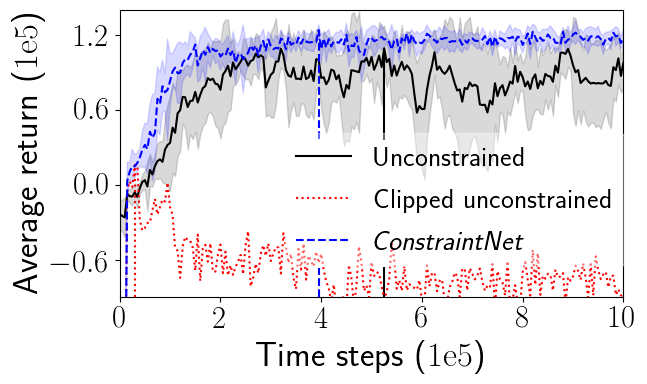
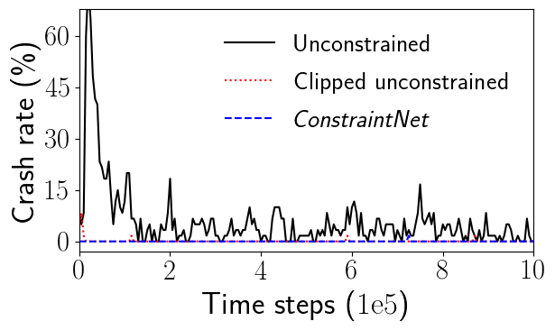

# ConstraintNet: Learning a follow object controller with deep reinforcement learning under safety constraints

This repository implements the reinforcement learning-based follow object controller (FOC) with safety constraints presented in the paper "Sample-Specific Output Constraints for Neural Networks". As reinforcement learing algorithm, we use the Twin Delayed DDPG algorithm proposed in the paper [Addressing Function Approximation Error in Actor-Critic Methos](https://arxiv.org/abs/1802.09477)[1] and build on code from [github.com/sfujim/TD3](https://github.com/sfujim/TD3).

## Requirements

To create a conda environment and install all required dependencies use the provided *environment.yml* file and run:

```setup
conda env create -f environment.yml
```

## Configuration files
For reproducability of the experiments, we provide option defintion files and configuration files. The option definition file defines options and the configuration file sets the options. The option definition file is located in *./options/opt_def.yaml*. In the folder *./options/* we provide a configuration file for training the unconstrained FOC, the clipped unconstrained FOC and  the *ConstraintNet* FOC.

## Training

To train one agent use the train script and specify the config file (unconstrained, clipped unconstrained or *ConstraintNet*), a unique experiment id and a random seed:

```train
python train.py --config ./options/config_unconstrained.yaml --experiment_id 0 --seed 0
python train.py --config ./options/config_unconstrained_clipped.yaml --experiment_id 50 --seed 0
python train.py --config ./options/config_ConstraintNet.yaml --experiment_id 100 --seed 0
```

## Pre-trained Models
Using six different random seeds, we trained six unconstrained agents (experiment ids 0, 1, 2, 3, 4 and 5), six clipped unconstrained agents (experiment ids: 50, 51, 52, 53, 54, 55) and six *ConstraintNet* agents (experiment ids 100, 101, 102, 103, 104 and 105).
Training those 18 agents was done using the script *./train_agents.sh*. The pretrained models and obtained rewards during training are stored in the *./experiments/* folder. We provide the weights after full training (10e5 time steps) and for maximum evaluation score during training (3.95e5 for *ConstraintNet*, 5.25e5 for unconstrained NN and 0.3e5 for clipped unconstrained). For repeating the training, the folders within ./experiments must be deleted or other experiment ids must be chosen.

## Evaluation

### Reward comparison during training of unconstrained and *ConstraintNet* FOC
To compare the reward during training of unconstrained, clipped unconstrained and *ConstraintNet* FOC, specify the method *reward* and set the experiment ids for unconstrained, clipped unconstrained and *ConstraintNet* FOC.
A plot *./foc_reward_comparison.png* will be generated.
```eval
python eval.py --method reward --exp_ids_unconstrained 0 1 2 3 4 5 --exp_ids_unconstrained_clipped 50 51 52 53 54 55 --exp_ids_ConstraintNet 100 101 102 103 104 105
```

### Crash rate comparison during training of unconstrained and *ConstraintNet* FOC
To compare the reward during training of unconstrained, clipped unconstrained and *ConstraintNet* FOC, specify the method *reward* and set the experiment ids for unconstrained and *ConstraintNet* FOC.
A plot *./foc_crash_rate_comparison.png* will be generated.
```eval
python eval.py --method crash_rate --exp_ids_unconstrained 0 1 2 3 4 5 --exp_ids_unconstrained_clipped 50 51 52 53 54 55 --exp_ids_ConstraintNet 100 101 102 103 104 105
```

### Metrics of learned behaviour
The learned FOC is evaluated and assessed using metrics. The crash rate (lower is better), safety (higher is better), discomfort (lower is better) and tracking error (lower is better) are calculated.

To evaluate the unconstrained FOC for 100 episodes and calculate the metrics run:
```eval
python eval.py --method metrics --exp_ids 0 1 2 3 4 5 --episodes 100 --training_steps 1_000_000 
python eval.py --method metrics --exp_ids 0 1 2 3 4 5 --episodes 100 --training_steps 525_000 
```
The `--training_steps` option loads the weights depending on the number of time steps for training the model.
To evaluate the clipped unconstrained FOC for 100 episodes and calculate the metrics run:
```eval
python eval.py --method metrics --exp_ids 50 51 52 53 54 55 --episodes 100 --training_steps 1_000_000 
python eval.py --method metrics --exp_ids 50 51 52 53 54 55 --episodes 100 --training_steps 30_000 
```
To evaluate the *ConstraintNet* FOC for 100 episodes and calculate the metrics run:
```eval
python eval.py --method metrics --exp_ids 100 101 102 103 104 105 --episodes 100 --training_steps 1_000_000
python eval.py --method metrics --exp_ids 100 101 102 103 104 105 --episodes 100 --training_steps 395_000
```

## Results
The plot shows the average reward during training of unconstrained, clipped unconstrained and *ConstraintNet* FOC over six trials. *ConstraintNet* FOC converges faster and shows more stable results than unconstrained FOC. Clipped unconstrained does not converge at all. Vertical lines indicate time steps with maximum return during traing (3.95e5 for *ConstraintNet*, 5.25e5 for unconstrained FOC, 0.3e5 for clipped unconstrained FOC). The clipped unconstrained FOC does not converge at all.)


The plot shows the average crash rate during training of unconstrained, clipped unconstrained and *ConstraintNet* FOC over six trials. While unconstrained FOC never learns to avoid all crashes, *ConstraintNet* and clipped unconstrained FOC shows much safer results. However,avoiding crashes by a postprocessing step (clipping to constraints) comes at the expense of bad learning behavior.


The table below shows a comparison of the learned behavior of unconstrained FOC and *ConstraintNet* FOC. The metrics were averages over six trained agents, which were each evaluated for 100 episodes.

| NN for policy | Time steps (1e5)            | Crash rate    | Safety        | Discomfort | Tracking error|
| ------------------ |---------------- |---------------- | -------------- | -------------- | -------------- |
 | *ConstraintNet* | 10.0 |**0.0 +- 0.0%** | **0.88 +- 0.01** | **0.61 +- 0.04** | **1.1 +- 0.3** |
| Unconstrained  | 10.0 |   0.7 +- 0.9%         | 0.81 +- 0.04 | 0.63 +- 0.04 | 2.1 +- 1.2 |
| Clipped unconstrained  | 10.0 |    **0.0 +- 0.0** %         |  0.85 +- 0.08 | 1.52 +- 1.00 | 4.8 +- 2.8 |
| *ConstraintNet* | 3.95 |**0.0 +- 0.0%** | **0.88 +- 0.01** | 0.69 +- 0.07 | **1.2 +- 0.3** |
| Unconstrained  | 5.25 |   3.7 +- 4.6 %         | 0.75 +- 0.04 | **0.53 +- 0.05** | 1.6 +- 0.2 |
| Clipped unconstrained  | 0.3 |   **0.0 +- 0.0%**         |  0.76 +- 0.02  | 1.04 +- 0.87 |  3.7 +- 2.7  |

# References
[1] Fujimoto et. al. 2018. Addressing Function Approximation Error in Actor-Critic Methos. 35th International Conference on Machine Learning (ICML). arxiv: https://arxiv.org/abs/1802.09477.
